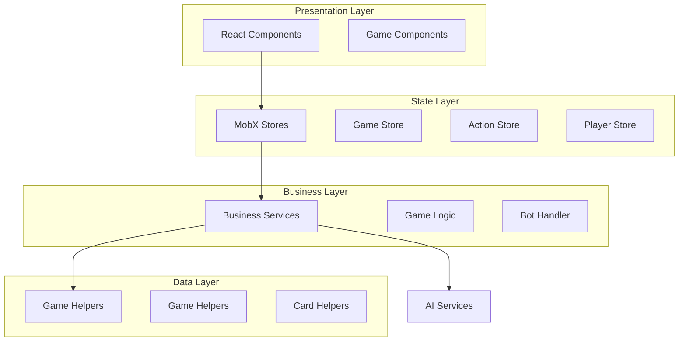
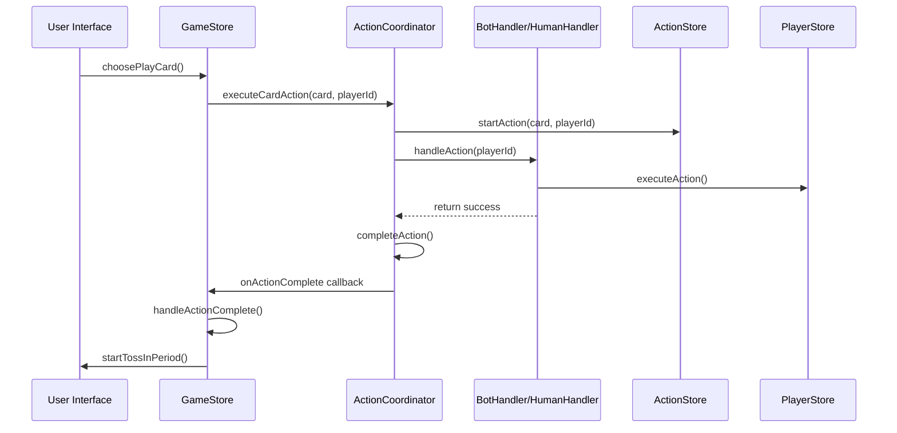

# Vinto Game Architecture

## Overview

Vinto is a card game application built with **Next.js 15**, **TypeScript**, and **MobX** for state management, organized as an **Nx monorepo**. The architecture follows a modular, store-based pattern with clear separation of concerns between game logic, UI components, and service layers.

## Technology Stack

- **Framework**: Next.js 15 with App Router
- **Language**: TypeScript
- **State Management**: MobX with React integration
- **Monorepo Tool**: Nx 21.5.3
- **Package Manager**: npm
- **Styling**: Tailwind CSS
- **Build Tool**: Turbopack

## Architecture Overview



## Core Architecture Patterns

### 1. **Singleton Store Pattern**
All stores implement the singleton pattern to ensure single source of truth:

```typescript
export class ActionStore {
  private static instance: ActionStore | null = null;
  
  private constructor() {
    makeAutoObservable(this);
  }
  
  static getInstance(): ActionStore {
    if (!ActionStore.instance) {
      ActionStore.instance = new ActionStore();
    }
    return ActionStore.instance;
  }
}
```

### 2. **Observer Pattern (MobX)**
Components are wrapped with `observer()` to react to state changes:

```typescript
export const GameTable = observer(() => {
  // Component automatically re-renders when store state changes
});
```

### 3. **Dependency Injection**
Services receive dependencies through constructor injection:

```typescript
export class BotActionHandler {
  constructor(deps: BotActionHandlerDependencies) {
    this.playerStore = deps.playerStore;
    this.actionStore = deps.actionStore;
    // ...
  }
}
```

## Store Architecture

### **Store Hierarchy**

1. **GameStore** - Pure mediator/orchestrator
   - Coordinates between stores
   - Initializes game and dependencies
   - Sets up callbacks and reactions
   - Minimal business logic

2. **PlayerStore** - Player state management
   - Player data and cards
   - Known/visible card positions
   - Card swapping operations
   - Turn advancement

3. **ActionStore** - Action execution state
   - Current action context
   - Swap/peek target selection
   - Pending card management
   - King action declarations

4. **DeckStore** - Card deck management
   - Draw pile management
   - Discard pile state
   - Card shuffling and dealing

5. **GamePhaseStore** - State machine management
   - Phase transitions (setup/playing/final/scoring)
   - Sub-phase tracking (idle/drawing/choosing/selecting/awaiting_action/declaring_rank/ai_thinking/toss_queue_active/toss_queue_processing)
   - Valid transition enforcement
   - State validation

6. **TossInStore** - Toss-in mechanics
   - Timer management
   - Action queue processing
   - Toss-in validation
   - Bot participation handling
   - Card removal and penalty application

### **Store Communication Pattern**

```typescript
// Stores communicate through method calls, not direct state access
gameStore.advanceTurn() -> playerStore.getCurrentPlayer()
actionStore.startAction() -> gamePhaseStore.setWaitingForAction()
```

## Service Layer Architecture

### **Core Services**

#### **1. ActionCoordinator**
Routes actions between human and bot handlers:
- **Responsibilities**: Action routing, callback management, action completion
- **Dependencies**: PlayerStore, ActionStore, DeckStore, GamePhaseStore, BotDecisionService
- **Pattern**: Async/await for bot actions, synchronous for human actions
- **Key Methods**: `executeCardAction()`, `selectActionTarget()`, `confirmPeekCompletion()`

#### **2. HumanActionHandler**
Manages human player interactions:
- **Responsibilities**: User input prompts, target validation, UI feedback
- **Dependencies**: PlayerStore, ActionStore
- **Pattern**: Returns immediately, waits for user confirmation
- **Key Actions**: Peek, swap, force draw target selection

#### **3. BotActionHandler**
Manages bot player automation:
- **Responsibilities**: Automated decisions, action execution
- **Dependencies**: PlayerStore, ActionStore, DeckStore, BotDecisionService
- **Pattern**: Async/await with `simulateBotThinking()` delay
- **Key Actions**: All card actions with AI decision-making

#### **4. BotDecisionService**
Provides AI decision logic:
- **Responsibilities**: Target selection algorithms, strategic decisions
- **Input**: Game context (BotDecisionContext) and available options
- **Output**: Decision objects with targets and actions
- **Difficulty Levels**: Easy, Moderate, Hard

#### **5. GameToastService**
Handles user notifications:
- **Responsibilities**: Success/error/info message display
- **Pattern**: Static methods for global access
- **Integration**: Used by all action handlers

## Component Architecture

### **Component Hierarchy**

```
Page (app/page.tsx)
├── GameHeader (difficulty, phase info)
├── GameTable (main game board)
│   ├── PlayerArea (for each player)
│   │   ├── Card components
│   │   └── PlayerInfo
│   ├── DrawPile
│   └── DiscardPile
├── GamePhaseIndicators
├── GameControls (human actions)
├── RankDeclaration (action selection)
└── FinalScores (game end)
```

### **Component Communication**

- **Props Down**: Static data and callbacks
- **MobX Up**: State changes through store methods
- **Event Handling**: User actions trigger store updates

### **Responsive Design Strategy**

- **Mobile**: Vertical stack layout, compact spacing
- **Desktop**: Horizontal layout with side panels
- **Breakpoint**: `md:` (768px) for layout transitions
- **Font Scaling**: Responsive typography system

## Game Flow Architecture

### **Phase Management**

1. **Setup Phase**
   - Card dealing and initial state
   - Memory card selection (peek 2 cards)
   - Player preparation

2. **Playing Phase** 
   - Turn-based card actions
   - Draw or take from discard
   - Action card effects (7-A, J-K)

3. **Final Round**
   - Triggered by "Call Vinto"
   - Each player gets one final turn
   - Game ends after complete rotation

4. **Scoring Phase**
   - Card value calculation
   - Winner determination
   - Results display

### **Turn Flow**

```typescript
// Turn sequence managed by GameStore
1. gameStore.startTurn()
2. Check if human or bot player
3. If bot: BotActionHandler.executeAction()
4. If human: Wait for user input via GameControls
5. Process action through ActionStore
6. gameStore.advanceTurn()
```

### **Action Processing Pipeline**



## Data Flow Architecture

### **State Updates**

1. **User Action** → Component Event Handler
2. **Event Handler** → Store Method Call  
3. **Store Method** → State Mutation (MobX)
4. **State Change** → Component Re-render (Observer)

### **Game State Persistence**

- **In-Memory**: All game state in MobX stores
- **Session**: No persistence across browser refresh
- **Reset**: Clean slate for each new game

## AI & Bot Architecture

### **Bot Intelligence Levels**

- **Easy**: Random decisions, basic heuristics
- **Moderate**: Simple strategic decisions
- **Hard**: Advanced logic and memory utilization

### **Decision Context**

```typescript
interface BotDecisionContext {
  currentPlayer: Player;
  opponents: Player[];
  discardPile: Card[];
  knownCards: Map<string, Card[]>;
  difficulty: Difficulty;
}
```

### **AI Execution Pattern**

- **Local Only**: All bot decisions run in browser via BotDecisionService
- **Async/Await**: Bot actions use `async simulateBotThinking()` for realistic delays
- **No setTimeout**: All delays centralized in `simulateBotThinking()` (to be replaced with actual AI computation)
- **Immediate Completion**: Bot actions that don't need user input complete immediately after execution

## File Organization

```
apps/vinto/src/app/
├── components/              # React UI components
│   ├── card.tsx            # Individual card display
│   ├── game-table.tsx      # Main game board
│   ├── player-area.tsx     # Player cards and info
│   ├── game-controls.tsx   # Human action controls
│   └── rank-declaration.tsx # Rank declaration UI
├── stores/                 # MobX state stores
│   ├── game-store.ts       # Pure mediator/orchestrator
│   ├── action-store.ts     # Action execution state
│   ├── player-store.ts     # Player management
│   ├── deck-store.ts       # Card deck state
│   ├── game-phase-store.ts # State machine
│   ├── toss-in-store.ts    # Toss-in mechanics
│   ├── action-coordinator.ts # Action routing
│   ├── human-action-handler.ts # Human player logic
│   └── bot-action-handler.ts   # Bot player logic
├── services/               # Business logic services
│   ├── bot-decision.ts     # AI decision algorithms
│   └── timer-service.ts    # Timer management
├── lib/                    # Utility functions
│   ├── game-helpers.ts     # Game logic utilities
│   └── toast-service.ts    # User notifications
└── shapes.ts              # TypeScript interfaces
```

## Recent Architectural Improvements

### **Refactoring to Pure Mediator Pattern (2025)**

**Key Changes:**
1. **GameStore Simplification**: Reduced from 690 lines to 652 lines by extracting responsibilities
2. **Toss-In Logic Extraction**: Moved to TossInStore with full responsibility for toss-in mechanics
3. **Action Handler Separation**: Split into HumanActionHandler and BotActionHandler for clear concerns
4. **Async/Await Bot Actions**: Replaced setTimeout callbacks with proper async/await pattern
5. **State Machine Formalization**: GamePhaseStore now enforces valid transitions with comprehensive documentation
6. **Callback-Based Completion**: ActionCoordinator uses `onActionComplete` callback for proper flow control

**Architecture Benefits:**
- **Testability**: Each handler can be tested in isolation
- **Maintainability**: Clear separation of human vs bot logic
- **Extensibility**: Easy to add new action types or AI strategies
- **Type Safety**: Strong typing throughout with TypeScript
- **State Integrity**: Enforced state machine transitions prevent invalid states

### **Eliminated Anti-Patterns:**
- ❌ **setTimeout for bot delays**: Replaced with centralized `simulateBotThinking()`
- ❌ **Direct state mutation**: All changes through proper store methods
- ❌ **Circular dependencies**: Clean dependency injection pattern
- ❌ **Mixed responsibilities**: Each store has single, clear purpose
- ❌ **Legacy code**: Removed OracleVintoClient and card-action-handler.ts

## Performance Considerations

### **MobX Optimizations**

- **Observer Granularity**: Fine-grained component observers
- **Computed Values**: Cached derived state calculations  
- **Actions**: Batch multiple state changes
- **Reaction**: Minimal side-effect listeners

### **Rendering Optimizations**

- **Component Splitting**: Separate concerns for better re-render control
- **Memo**: Strategic use of React.memo for pure components
- **Key Props**: Stable keys for list rendering efficiency

### **Memory Management**

- **Singleton Stores**: Prevent memory leaks from multiple instances
- **Cleanup**: Store reset methods for testing
- **Event Listeners**: Proper cleanup in useEffect hooks

## Security Considerations

### **Client-Side Game State**

- **Validation**: All moves validated on client
- **Cheating Prevention**: Game logic encapsulation
- **State Integrity**: MobX immutable patterns

### **AI Service Communication**

- **Rate Limiting**: Prevent API abuse
- **Timeout Handling**: Graceful degradation
- **Error Boundaries**: Isolate AI service failures

## Testing Architecture

### **Store Testing**

- **Unit Tests**: Individual store method testing
- **Integration**: Cross-store interaction testing
- **Mocking**: Service dependency isolation

### **Component Testing**

- **Observer Testing**: MobX state change verification
- **User Interaction**: Event handler testing
- **Rendering**: Component output validation

### **Game Logic Testing**

- **Rule Validation**: Game rule compliance
- **Edge Cases**: Boundary condition handling
- **AI Behavior**: Bot decision consistency

## Future Architecture Considerations

### **Multiplayer Support**

- **WebSocket Integration**: Real-time state synchronization
- **Server State**: Authoritative game state validation
- **Conflict Resolution**: Concurrent action handling

### **Persistence Layer**

- **Game Saves**: Mid-game state persistence
- **User Profiles**: Player statistics and preferences
- **Game History**: Match replay capabilities

### **Performance Scaling**

- **Web Workers**: AI computation offloading
- **Code Splitting**: Lazy component loading
- **Service Workers**: Offline game capability

---

*This architecture documentation reflects the current state of the Vinto game application as of the analysis date. The modular design supports future enhancements while maintaining clean separation of concerns and testability.*