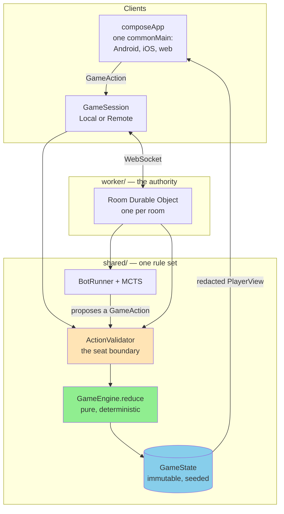
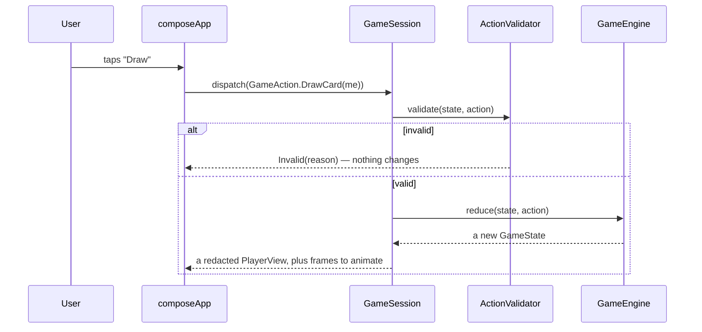
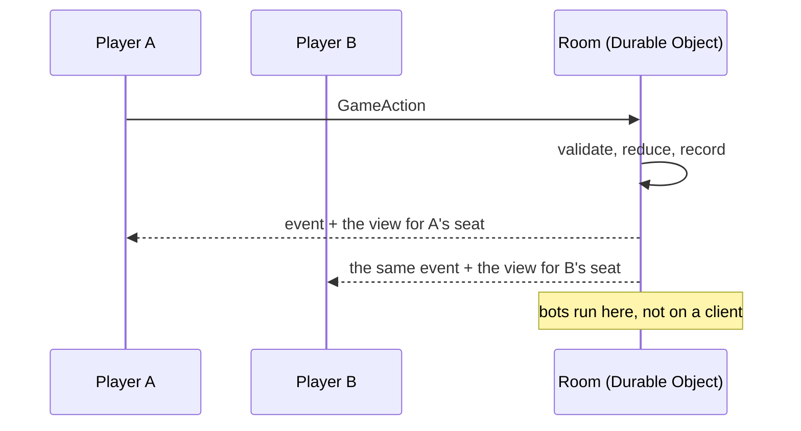

# Vinto Card Game

[](https://kotlinlang.org/)
[](https://www.jetbrains.com/lp/compose-multiplatform/)
[](https://workers.cloudflare.com/)
[](https://deepwiki.com/Lonli-Lokli/vinto)
[](LICENSE)
[](CONTRIBUTING.md)

An **unofficial** client for the card game **VINTO**, built with **Kotlin Multiplatform**,
**Compose Multiplatform** and a **pure reducer**. One rule set runs on Android, iOS, the web
and inside a Cloudflare Durable Object — the same `GameEngine.reduce`, not a client copy of a
server's rules.

> ### Whose game this is
>
> **VINTO is not ours.** It is a card game designed and published by other people, and this
> repository is an unofficial app for playing it — written out of admiration, with no
> affiliation to or endorsement from its creators.
>
> **The original is at [vinto.game](https://vinto.game)** — the rules, the printed deck, and
> the people who made it. If you enjoy the game here, that is where to go next.
>
> Every client says so on its own first screen, and links there; `AttributionTest` fails if a
> refactor loses the line.

## Features

- **4-Player Game**: One human player vs three AI opponents
- **Strategic Gameplay**: Action cards (7-A) with special abilities
- **Cloud-Ready Architecture**: Pure GameEngine that can be hosted remotely
- **Responsive Design**: Optimized for both mobile and desktop
- **One engine**: the same pure reducer on every client and on the server
- **AI Opponents**: MCTS-based bot decision making

## Game Rules

### Setup

- Each player starts with 5 cards
- Players get to peek at 2 of their own cards
- Goal: Achieve the lowest total score

### Gameplay

On your turn, you can either:

1. **Draw from deck** - Draw a new card and choose to swap or play
2. **Take from discard** - Take an unplayed action card (7-K) from discard pile
3. **Call Vinto** - End the game when you think you have the lowest score

### Action Cards

- **7 (Peek Own)**: Look at one of your own cards
- **8 (Peek Own)**: Look at one of your own cards
- **9 (Peek Opponent)**: Look at one opponent's card
- **10 (Peek Opponent)**: Look at one opponent's card
- **Jack (Swap Cards)**: Swap any two cards from two different players
- **Queen (Peek & Swap)**: Peek at two cards from two different players, then optionally swap them
- **King (Declare Rank)**: All players must toss in cards of declared rank

### Scoring

- Number cards (1-6): Face value
- Action cards (7-Q): 10 points each
- King: 0 point
- Ace: 1 point
- Joker: -1 point
- Game ends when someone calls Vinto - all cards revealed and scored

## Architecture

### System overview

The single most important thing on this diagram is that **`shared/engine` appears once**. The
same `GameEngine.reduce` runs on a phone, in a browser and inside a Durable Object; a rule is
not "implemented on the server and mirrored on the client".


```mermaid
graph TB
    subgraph Clients
        UI[composeApp<br/>one commonMain:<br/>Android, iOS, web]
        Session[GameSession<br/>Local or Remote]
    end

    subgraph Shared["shared/ — one rule set"]
        AV[ActionValidator<br/>the seat boundary]
        GE[GameEngine.reduce<br/>pure, deterministic]
        GS[(GameState<br/>immutable, seeded)]
        Bot[BotRunner + MCTS]
    end

    subgraph Server["worker/ — the authority"]
        Room[Room Durable Object<br/>one per room]
    end

    UI -->|GameAction| Session
    Session --> AV
    AV --> GE
    GE --> GS
    GS -->|redacted PlayerView| UI
    Bot -->|proposes a GameAction| AV
    Session <-->|WebSocket| Room
    Room --> AV
    Room --> Bot

    style GE fill:#90EE90
    style GS fill:#87CEEB
    style AV fill:#FFE4B5
```

### Action flow

Every interaction takes the same path, whoever sent it — a bot's move is validated exactly as a
stranger's is. There is no second path into the engine.


```mermaid
sequenceDiagram
    participant User
    participant UI as composeApp
    participant S as GameSession
    participant V as ActionValidator
    participant E as GameEngine

    User->>UI: taps "Draw"
    UI->>S: dispatch(GameAction.DrawCard(me))
    S->>V: validate(state, action)
    alt invalid
        V-->>UI: Invalid(reason) — nothing changes
    else valid
        S->>E: reduce(state, action)
        E-->>S: a new GameState
        S-->>UI: a redacted PlayerView, plus frames to animate
    end
```

### Online

The room deals from a seed, validates everything, runs the bots server-side — a client-side bot
would need the other seats' hidden cards — and sends **each socket its own redacted view**.


```mermaid
sequenceDiagram
    participant A as Player A
    participant B as Player B
    participant Room as Room (Durable Object)

    A->>Room: GameAction
    Room->>Room: validate, reduce, record
    Room-->>A: event + the view for A's seat
    Room-->>B: the same event + the view for B's seat
    Note over Room: bots run here, not on a client
```


## Tech Stack

- **Language**: Kotlin 2.1, Kotlin Multiplatform
- **UI**: Compose Multiplatform (Android, iOS, wasmJs) from one `commonMain`
- **Game Engine**: pure reducer, deterministic, seeded PRNG
- **Server**: Cloudflare Worker + one Durable Object per room (Kotlin/JS)
- **AI**: Monte Carlo Tree Search (MCTS)
- **Build**: Gradle 8.14 on JDK 17; detekt at `maxIssues: 0`

## Project Structure

The Gradle build is the repository root. The rules live **once**, in Kotlin. They used to live
twice — a Next.js client came first, and the two were held identical by a replay corpus — and
what survives that arrangement is `fixtures/`: 50 games whose state hashes the TypeScript
engine computed, now frozen, and still replayed on every run.

```
shared/
  shapes/          # Card, Rank, GameState, GameAction, canonical JSON, SHA-256, Prng
  engine/          # GameEngine.reduce, ActionValidator, case handlers, replay
  bot/             # MCTS decision service, coalition planner, BotRunner
  client/          # GameSession: LocalGameSession (solo) and RemoteGameSession (online)
  protocol/        # The wire between a client and a room, declared once
  room/            # Room and registry cores, testable off the Worker
composeApp/        # Compose Multiplatform UI — Android, iOS and web from one commonMain
worker/            # Cloudflare Worker + Durable Object per room (Kotlin/JS)
iosApp/            # Xcode project embedding composeApp's framework
fixtures/          # The cross-implementation corpus: 50 recordings + PRNG vectors
docs/kotlin/       # ARCHITECTURE.md (the shape), README.md (the state), protocol, traps
```

- **shared/engine**: all game rules, state transitions and reducers. No UI, no side effects,
  no clock — the same reducer runs on a phone and inside a Durable Object.
- **shared/bot**: MCTS decision-making, reading only what a seat is allowed to see.
- **shared/client**: one `GameSession` interface with two lives, so the UI cannot tell a solo
  game from an online one.
- **worker**: the authoritative room. It deals from a seed, validates every action, and sends
  each socket its own redacted view.
- **fixtures**: 50 recordings and 13,900 actions, each carrying the state hash a *second
  implementation* computed. Frozen — it cannot be regenerated, and that is deliberate
  (`fixtures/recordings/README.md`).

## Getting Started

### Prerequisites

- JDK 17 (every module compiles with `jvmTarget = 17`; a newer JDK fails the build)
- Android SDK platform 36 for the Android target; Xcode for the iOS one
- Node 22 for the Worker tooling

Full setup, including the Android SDK pointer and the iOS bring-up:
[`docs/kotlin/README.md`](docs/kotlin/README.md).

### Development

```sh
./gradlew :composeApp:assembleDebug     # Android APK
./gradlew :composeApp:installDebug      # ...onto a connected phone or emulator
./gradlew :composeApp:wasmJsBrowserDistribution   # the Compose web bundle
```

### Tests

```sh
./gradlew :shared:engine:jvmTest        # the parity gate: every recording, every action
./gradlew detekt                        # static analysis, maxIssues 0
```

## Key Architecture Principles

### 1. Single source of truth

All game state lives in **`GameState`**, which is immutable. There is no parallel state in the
UI: `UiStore`-shaped duplication is what the `GameSession` seam exists to make unnecessary.

```kotlin
data class GameState(
    val players: List<PlayerState>,
    val currentPlayerIndex: Int,
    val phase: GamePhase,
    val drawPile: Pile,
    val discardPile: Pile,
    val rngState: Long,   // the seed, carried in the state — no ambient randomness
    // ...
)
```

### 2. A pure engine

`GameEngine.reduce` is a pure, total, deterministic function. No clock, no ambient randomness,
no I/O. That is not a style preference: it is what lets the same code be the authority inside a
Durable Object *and* the simulator inside MCTS, and it is what makes a recording a complete
description of a game.

```kotlin
fun reduce(state: GameState, action: GameAction): GameState
```

The handlers mutate a `MutableGameState` internally and `reduce` freezes it on the way out —
deliberately, because the port stayed literal while the parity corpus was the only thing
holding two engines together (`docs/kotlin/ARCHITECTURE.md` §3).

### 3. Actions as data

Every interaction — a tap, a bot's decision, a message off a socket — becomes a serializable
`GameAction`, and every one goes through the same two steps. There is no second path.

```kotlin
ActionValidator.validate(state, action)   // Valid | Invalid(reason)
GameEngine.reduce(state, action)          // a new state, or the same one
```

A bot does not apply its move directly; it proposes an action validated exactly as a stranger's
would be. That is what makes the room's anti-cheat boundary one line rather than an audit.

### 4. One session interface, two lives

`LocalGameSession` runs the engine and `BotRunner` in-process; `RemoteGameSession` runs them
over a socket. Both hand the screen the same redacted `PlayerView`, so a screen cannot tell
which it has — and a solo game touches no network at all, which `NoNetworkGuardTest` proves by
installing a `SecurityManager` that throws on any connect.

### 5. The room is authoritative

One Cloudflare Durable Object per room — see [Online](#online) above for what it does and why
the bots run there.

## State management

| | |
| --- | --- |
| `GameState` | Authoritative, immutable, lives in the engine |
| `PlayerView` | What one seat is allowed to see; the only thing a screen ever gets |
| Compose state | Modals, highlights, the animation queue — presentation only |

## Development notes

### Adding a new action

1. Add the type to `shared/shapes/.../GameAction.kt`
2. Add a handler under `shared/engine/src/commonMain/.../cases/`, wired into `GameEngine.reduce`
3. Teach `ActionValidator` when it is legal — including who may send it
4. Dispatch it from the UI

If the change moves any recorded state, note that **`fixtures/recordings` is frozen and cannot
be regenerated**: it carries hashes computed by a second implementation that no longer exists.
`fixtures/recordings/README.md` explains what to do instead, and `CorpusIsFrozenTest` will stop
you rewriting it.

### Testing game logic

The engine is pure, so its tests are ordinary unit tests:

```kotlin
@Test
fun drawingACardTakesOneOffThePile() {
    val before = initializeGame(seed = 42)
    val after = GameEngine.reduce(before, GameAction.DrawCard(PlayerIdPayload("p1")))

    assertEquals(before.drawPile.size - 1, after.drawPile.size)
    assertNotNull(after.players[0].pendingCard)
}
```

## Continuous integration

`.github/workflows/kmp.yml` runs six checks, split by what each needs rather than by what it
covers: `kmp-detekt`, `kmp-jvm` (the parity gate), `kmp-web` (the same `commonTest` suites on
Kotlin/JS and Wasm, plus the web client's compile), `kmp-android` (APK + headless Compose
suites), `kmp-worker` (the Kotlin/JS bundle, the room gates through workerd, and the size
budget) and `kmp-ios`. The macOS leg is rationed — pushes, nightly, on demand, and on a pull
request labelled `ios` — because it bills at ten times the Linux rate.

Beside them sit two workflows that check nothing and publish, both `workflow_dispatch` only
because deploying is a decision rather than a consequence of merging: `deploy-room.yml` for the
room Worker and `deploy-web.yml` for the website.


## Contributing

1. Fork the repository
2. Create a feature branch
3. Make your changes
4. Ensure tests pass and build succeeds
5. Submit a pull request

## License

MIT

## Links

- [Kotlin Multiplatform](https://kotlinlang.org/docs/multiplatform.html)
- [Compose Multiplatform](https://www.jetbrains.com/lp/compose-multiplatform/)
- [Cloudflare Durable Objects](https://developers.cloudflare.com/durable-objects/)
- [Architecture](docs/kotlin/ARCHITECTURE.md) — the shape of the system, and its invariants
