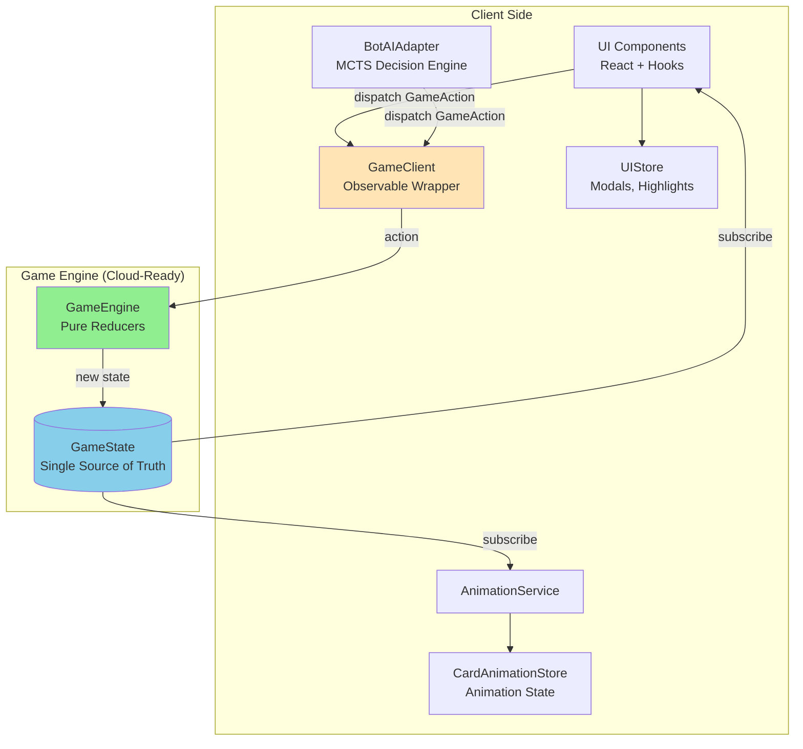
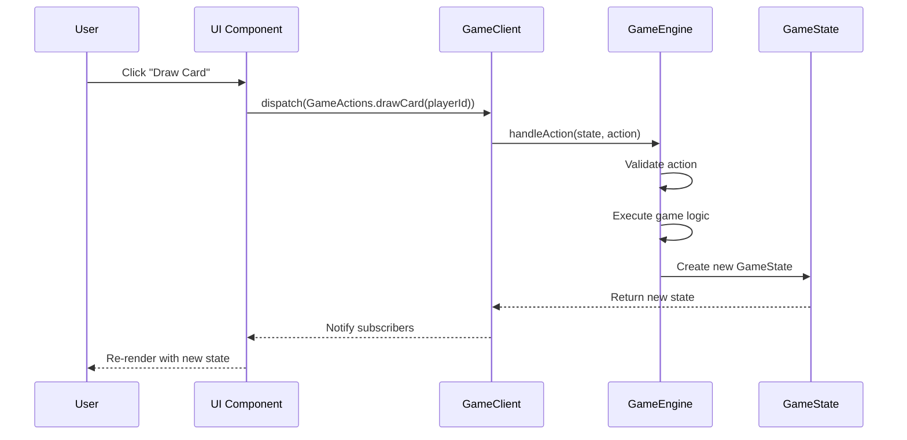
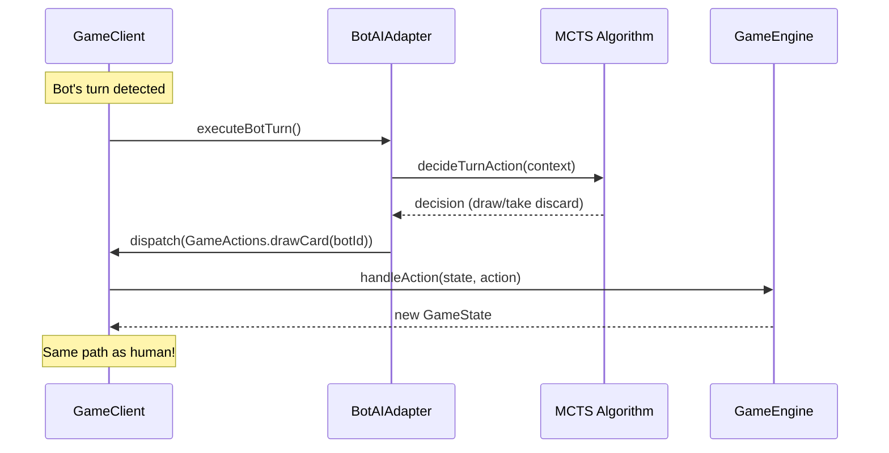
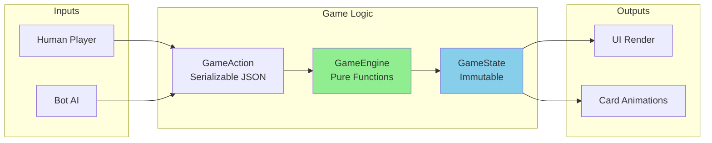

# Vinto Card Game

[](https://www.typescriptlang.org/)
[](https://nextjs.org/)
[](https://reactjs.org/)
[](https://deepwiki.com/Lonli-Lokli/vinto)
[](https://nx.dev/)
[](LICENSE)
[](CONTRIBUTING.md)

A strategic multiplayer card game built with **Next.js**, **TypeScript**, and a **pure reducer-based architecture**. Vinto features 4-player gameplay with AI opponents, action cards with special abilities, and cloud-ready game engine.

## Features

- **4-Player Game**: One human player vs three AI opponents
- **Strategic Gameplay**: Action cards (7-A) with special abilities
- **Cloud-Ready Architecture**: Pure GameEngine that can be hosted remotely
- **Responsive Design**: Optimized for both mobile and desktop
- **Type-Safe**: Full TypeScript implementation with strict mode
- **AI Opponents**: MCTS-based bot decision making

## Game Rules

### Setup

- Each player starts with 5 cards
- Players get to peek at 2 of their own cards
- Goal: Achieve the lowest total score

### Gameplay

On your turn, you can either:

1. **Draw from deck** - Draw a new card and choose to swap or play
2. **Take from discard** - Take an unplayed action card (7-K) from discard pile
3. **Call Vinto** - End the game when you think you have the lowest score

### Action Cards

- **7 (Peek Own)**: Look at one of your own cards
- **8 (Peek Own)**: Look at one of your own cards
- **9 (Peek Opponent)**: Look at one opponent's card
- **10 (Peek Opponent)**: Look at one opponent's card
- **Jack (Swap Cards)**: Swap any two cards from two different players
- **Queen (Peek & Swap)**: Peek at two cards from two different players, then optionally swap them
- **King (Declare Rank)**: All players must toss in cards of declared rank

### Scoring

- Number cards (1-6): Face value
- Action cards (7-Q): 10 points each
- King: 0 point
- Ace: 1 point
- Joker: -1 point
- Game ends when someone calls Vinto - all cards revealed and scored

## Architecture

### System Overview


```mermaid
graph TB
    subgraph "Client Side"
        UI[UI Components<br/>React + Hooks]
        GC[GameClient<br/>Observable Wrapper]
        BotAI[BotAIAdapter<br/>MCTS Decision Engine]
        Anim[AnimationService]
        UIStore[UIStore<br/>Modals, Highlights]
        AnimStore[CardAnimationStore<br/>Animation State]
    end

    subgraph "Game Engine (Cloud-Ready)"
        GE[GameEngine<br/>Pure Reducers]
        GS[(GameState<br/>Single Source of Truth)]
    end

    UI -->|dispatch GameAction| GC
    BotAI -->|dispatch GameAction| GC
    GC -->|action| GE
    GE -->|new state| GS
    GS -->|subscribe| UI
    GS -->|subscribe| Anim
    Anim --> AnimStore
    UI --> UIStore

    style GE fill:#90EE90
    style GS fill:#87CEEB
    style GC fill:#FFE4B5
```

### Action Flow


```mermaid
sequenceDiagram
    participant User
    participant UI as UI Component
    participant GC as GameClient
    participant GE as GameEngine
    participant State as GameState

    User->>UI: Click "Draw Card"
    UI->>GC: dispatch(GameActions.drawCard(playerId))
    GC->>GE: handleAction(state, action)
    GE->>GE: Validate action
    GE->>GE: Execute game logic
    GE->>State: Create new GameState
    State-->>GC: Return new state
    GC-->>UI: Notify subscribers
    UI-->>User: Re-render with new state
```

### Bot AI Flow


```mermaid
sequenceDiagram
    participant GC as GameClient
    participant Bot as BotAIAdapter
    participant MCTS as MCTS Algorithm
    participant GE as GameEngine

    Note over GC: Bot's turn detected
    GC->>Bot: executeBotTurn()
    Bot->>MCTS: decideTurnAction(context)
    MCTS-->>Bot: decision (draw/take discard)
    Bot->>GC: dispatch(GameActions.drawCard(botId))
    GC->>GE: handleAction(state, action)
    GE-->>GC: new GameState
    Note over GC: Same path as human!
```

### Data Flow


```mermaid
graph LR
    subgraph "Inputs"
        Human[Human Player]
        Bot[Bot AI]
    end

    subgraph "Game Logic"
        Action[GameAction<br/>Serializable JSON]
        Engine[GameEngine<br/>Pure Functions]
        State[GameState<br/>Immutable]
    end

    subgraph "Outputs"
        UI[UI Render]
        Animations[Card Animations]
    end

    Human --> Action
    Bot --> Action
    Action --> Engine
    Engine --> State
    State --> UI
    State --> Animations

    style Engine fill:#90EE90
    style State fill:#87CEEB
```

## Tech Stack

**Kotlin — the build that ships**

- **Language**: Kotlin 2.1, Kotlin Multiplatform
- **UI**: Compose Multiplatform (Android, iOS, wasmJs) from one `commonMain`
- **Game Engine**: pure reducer, deterministic, seeded PRNG
- **Server**: Cloudflare Worker + one Durable Object per room (Kotlin/JS)
- **AI**: Monte Carlo Tree Search (MCTS)
- **Build**: Gradle 8.14 on JDK 17; detekt at `maxIssues: 0`

**legacy-web — retired, kept as the parity reference**

- Next.js 15 (App Router), TypeScript strict, MobX, tsyringe, Tailwind, Nx

## Project Structure

The Gradle build is the repository root. The Next.js client that came first is retired under
`legacy-web/`; the rules now live twice, in Kotlin and in TypeScript, held identical by a
replay corpus that both engines are checked against.

```
shared/
  shapes/          # Card, Rank, GameState, GameAction, canonical JSON, SHA-256, Prng
  engine/          # GameEngine.reduce, ActionValidator, case handlers, replay
  bot/             # MCTS decision service, coalition planner, BotRunner
  client/          # GameSession: LocalGameSession (solo) and RemoteGameSession (online)
  protocol/        # The wire between a client and a room, declared once
  room/            # Room and registry cores, testable off the Worker
composeApp/        # Compose Multiplatform UI — Android, iOS and web from one commonMain
worker/            # Cloudflare Worker + Durable Object per room (Kotlin/JS)
iosApp/            # Xcode project embedding composeApp's framework
fixtures/          # The cross-implementation corpus: 50 recordings + PRNG vectors
docs/kotlin/       # Setup, module map, commands, protocol, traps
legacy-web/        # The retired Next.js client and its Nx workspace (frozen)
```

- **shared/engine**: all game rules, state transitions and reducers. No UI, no side effects,
  no clock — the same reducer runs on a phone and inside a Durable Object.
- **shared/bot**: MCTS decision-making, reading only what a seat is allowed to see.
- **shared/client**: one `GameSession` interface with two lives, so the UI cannot tell a solo
  game from an online one.
- **worker**: the authoritative room. It deals from a seed, validates every action, and sends
  each socket its own redacted view.
- **fixtures**: the contract. 50 recordings and 13,900 actions, each carrying the state hash
  TypeScript computed; the Kotlin engine has to reproduce every one.

## Getting Started

### Prerequisites

- JDK 17 (every module compiles with `jvmTarget = 17`; a newer JDK fails the build)
- Android SDK platform 36 for the Android target; Xcode for the iOS one
- Node 22 for the Worker tooling and for `legacy-web/`

Full setup, including the Android SDK pointer and the iOS bring-up:
[`docs/kotlin/README.md`](docs/kotlin/README.md).

### Development

```sh
./gradlew :composeApp:assembleDebug     # Android APK
./gradlew :composeApp:installDebug      # ...onto a connected phone or emulator
./gradlew :composeApp:wasmJsBrowserDistribution   # the Compose web bundle
```

### Tests

```sh
./gradlew :shared:engine:jvmTest        # the parity gate: every recording, every action
./gradlew detekt                        # static analysis, maxIssues 0
```

### The retired web client

```sh
cd legacy-web && npm install && npm test
```

## Key Architecture Principles

### 1. Single Source of Truth

All game state lives in **GameState** (immutable). No parallel state in stores.

```typescript
interface GameState {
  players: PlayerState[];
  currentPlayerIndex: number;
  phase: GamePhase;
  drawPile: Card[];
  discardPile: Card[];
  // ... complete game state
}
```

### 2. Pure Game Engine

**GameEngine** contains only pure functions (reducers):

- No side effects
- No async operations
- Deterministic
- Easily testable
- **Can be hosted in cloud**

```typescript
function handleDrawCard(state: GameState, action: DrawCardAction): GameState {
  // Pure function - no mutations
  const newState = copy(state);
  // ... game logic
  return newState;
}
```

### 3. Actions as Data

All game interactions are represented as **serializable actions**:

```typescript
type GameAction = { type: 'DRAW_CARD'; payload: { playerId: string } } | { type: 'SWAP_CARD'; payload: { playerId: string; position: number } } | { type: 'USE_CARD_ACTION'; payload: { playerId: string; card: Card } };
// ... all game actions
```

### 4. Cloud-Ready Design

**Current (Local):**

```typescript
gameClient.dispatch(GameActions.drawCard(playerId));
// GameEngine runs locally
```

**Future (Cloud/Multiplayer):**

```typescript
networkClient.dispatch(GameActions.drawCard(playerId));
// ↓ WebSocket to cloud
// Cloud GameEngine processes
// ↓ Broadcast new state to all clients
```

### 5. Bot AI Integration

Bots use the **same action dispatch path** as humans:

- MCTS algorithm decides action (client-side currently)
- Dispatches regular GameAction to engine
- Engine validates and executes (same as human actions)
- Can be moved to cloud GameEngine in future

## State Management

### GameState (Authoritative)

- Lives in GameEngine
- Immutable
- Single source of truth
- Used by all components

### UI Stores (Client-Only)

- **UIStore**: Modals, toasts, temporary highlights
- **CardAnimationStore**: Animation state

These stores contain **UI-specific state** that doesn't affect game logic.

## Development Notes

### Adding a New Action

1. **Define action type** in `engine/types/GameAction.ts`:

```typescript
export interface MyNewAction {
  type: 'MY_NEW_ACTION';
  payload: {
    /* action data */
  };
}
```

2. **Create handler** in `engine/cases/my-new-action.ts`:

```typescript
export function handleMyNewAction(state: GameState, action: MyNewAction): GameState {
  const newState = copy(state);
  // ... pure logic
  return newState;
}
```

3. **Add to engine** in `engine/GameEngine.ts`:

```typescript
case 'MY_NEW_ACTION':
  return handleMyNewAction(state, action);
```

4. **Dispatch from UI**:

```typescript
gameClient.dispatch({
  type: 'MY_NEW_ACTION',
  payload: {
    /* data */
  },
});
```

### Testing Game Logic

GameEngine is easy to test (pure functions):

```typescript
test('drawing card updates state correctly', () => {
  const initialState = createGameState();
  const action = { type: 'DRAW_CARD', payload: { playerId: 'player1' } };

  const newState = GameEngine.handleAction(initialState, action);

  expect(newState.drawPile.length).toBe(initialState.drawPile.length - 1);
  expect(newState.players[0].pendingCard).toBeDefined();
});
```

## Future Enhancements

### Multiplayer Support

The architecture is ready for multiplayer:

1. Replace `GameClient` with `NetworkClient`
2. Host `GameEngine` on server
3. Use WebSocket for action dispatch and state broadcast

### Cloud Bot AI

Move MCTS algorithm to cloud GameEngine:

- Reduces client bundle size
- Enables spectator mode (no bot code needed)
- Server-side bot computation

### Save/Load

Game state is fully serializable:

```typescript
const saveData = JSON.stringify(gameClient.state);
localStorage.setItem('saved_game', saveData);
```

### Time Travel Debugging

Record all actions for replay:

```typescript
const history: GameAction[] = [];
// Replay entire game by applying actions in order
```

## Continuous integration

`.github/workflows/kmp.yml` runs five checks, split by what each needs rather than by what
it covers: `kmp-detekt`, `kmp-jvm` (the parity gate), `kmp-android` (APK + headless Compose
suites), `kmp-worker` (the Kotlin/JS bundle, the room gates through workerd, and the Worker
size budget) and `kmp-ios`. The macOS leg is rationed — pushes, nightly, on demand, and on a
pull request labelled `ios` — because it bills at ten times the Linux rate.

`legacy-web.yml` runs the retired workspace's tests, and only when something under
`legacy-web/` or `fixtures/` changes.

## Nx Workspace (legacy-web)

The retired web client still uses Nx:

```sh
cd legacy-web
npx nx graph
npx nx show project vinto
```

## Contributing

1. Fork the repository
2. Create a feature branch
3. Make your changes
4. Ensure tests pass and build succeeds
5. Submit a pull request

## License

MIT

## Links

- [Nx Documentation](https://nx.dev)
- [Next.js Documentation](https://nextjs.org/docs)
- [MobX Documentation](https://mobx.js.org)
