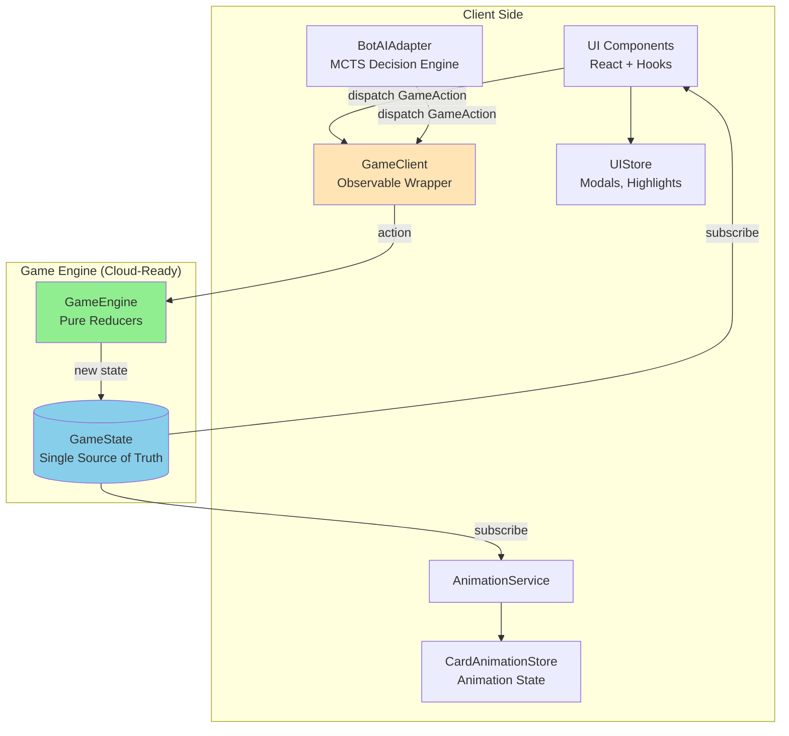
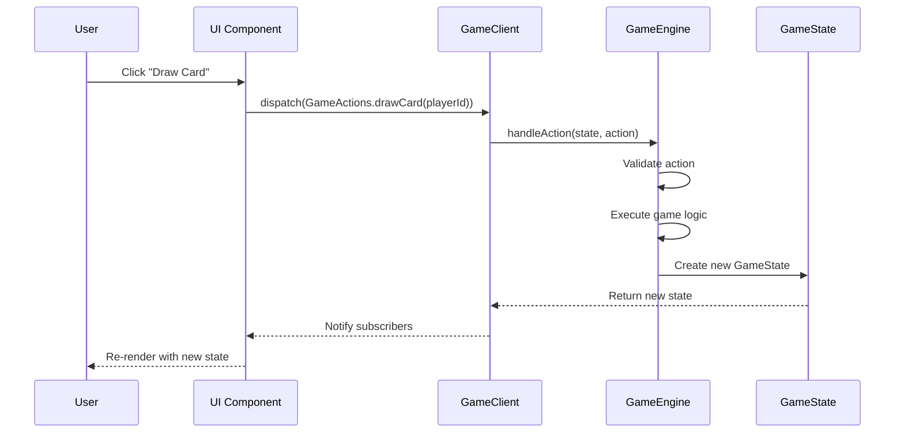
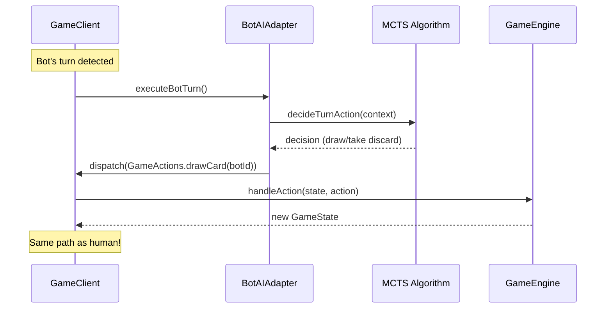
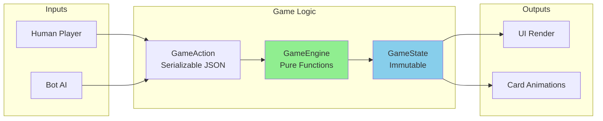

# Vinto Card Game

A strategic multiplayer card game built with **Next.js**, **TypeScript**, and a **pure reducer-based architecture**. Vinto features 4-player gameplay with AI opponents, action cards with special abilities, and cloud-ready game engine.

## Features

- **4-Player Game**: One human player vs three AI opponents
- **Strategic Gameplay**: Action cards (7-K) with special abilities
- **Cloud-Ready Architecture**: Pure GameEngine that can be hosted remotely
- **Responsive Design**: Optimized for both mobile and desktop
- **Type-Safe**: Full TypeScript implementation with strict mode
- **AI Opponents**: MCTS-based bot decision making

## Game Rules

### Setup

- Each player starts with 4 cards
- Players get to peek at 2 of their own cards
- Goal: Achieve the lowest total score

### Gameplay

On your turn, you can either:

1. **Draw from deck** - Draw a new card and choose to swap or play
2. **Take from discard** - Take an unplayed action card (7-K) from discard pile
3. **Call Vinto** - End the game when you think you have the lowest score

### Action Cards

- **7 (Peek Own)**: Look at one of your own cards
- **8 (Peek Own)**: Look at one of your own cards
- **9 (Peek Opponent)**: Look at one opponent's card
- **10 (Peek Opponent)**: Look at one opponent's card
- **Jack (Swap Cards)**: Swap any two cards from two different players
- **Queen (Peek & Swap)**: Peek at two cards from two different players, then optionally swap them
- **King (Declare Rank)**: All players must toss in cards of declared rank

### Scoring

- Number cards (1-6): Face value
- Action cards (7-K): 10 points each
- Pairs in same column: 0 points
- Game ends when someone calls Vinto - all cards revealed and scored

## Architecture

### System Overview



### Action Flow



### Bot AI Flow



### Data Flow



## Tech Stack

- **Framework**: Next.js 15 (App Router)
- **Language**: TypeScript (strict mode)
- **Game Engine**: Pure reducer pattern (Redux-inspired)
- **State Management**: MobX (UI stores only)
- **Dependency Injection**: tsyringe
- **AI**: Monte Carlo Tree Search (MCTS)
- **Styling**: Tailwind CSS
- **Build Tool**: Nx monorepo

## Project Structure

```
apps/
  vinto/           # Main Next.js app (UI, integration, entrypoint)

packages/
  engine/          # Core game logic and rules (pure, deterministic, cloud-ready)
  bot/             # AI bot logic for automated players
  local-client/    # Client-side state management for local games (React hooks, context, services)
  shapes/          # Shared types, interfaces, and constants used by all packages
```

- **apps/vinto**: The main application, integrating all packages and providing the user interface.
- **engine**: Implements all game rules, state transitions, and reducers. No UI or side effects.
- **bot**: Provides AI player logic, decision-making, and strategy for bots.
- **local-client**: Manages client-side state, user actions, and UI integration for local games.
- **shapes**: Exports TypeScript types, interfaces, and constants used by all packages.

## Getting Started

### Prerequisites

- Node.js 18+
- npm or yarn

### Installation

```sh
npm install
```

### Development

Run the dev server:

```sh
npx nx dev vinto
```

Open [http://localhost:4200](http://localhost:4200) in your browser.

### Build

Create a production bundle:

```sh
npx nx build vinto
```

## Key Architecture Principles

### 1. Single Source of Truth

All game state lives in **GameState** (immutable). No parallel state in stores.

```typescript
interface GameState {
  players: PlayerState[];
  currentPlayerIndex: number;
  phase: GamePhase;
  drawPile: Card[];
  discardPile: Card[];
  // ... complete game state
}
```

### 2. Pure Game Engine

**GameEngine** contains only pure functions (reducers):

- No side effects
- No async operations
- Deterministic
- Easily testable
- **Can be hosted in cloud**

```typescript
function handleDrawCard(state: GameState, action: DrawCardAction): GameState {
  // Pure function - no mutations
  const newState = copy(state);
  // ... game logic
  return newState;
}
```

### 3. Actions as Data

All game interactions are represented as **serializable actions**:

```typescript
type GameAction = { type: 'DRAW_CARD'; payload: { playerId: string } } | { type: 'SWAP_CARD'; payload: { playerId: string; position: number } } | { type: 'USE_CARD_ACTION'; payload: { playerId: string; card: Card } };
// ... all game actions
```

### 4. Cloud-Ready Design

**Current (Local):**

```typescript
gameClient.dispatch(GameActions.drawCard(playerId));
// GameEngine runs locally
```

**Future (Cloud/Multiplayer):**

```typescript
networkClient.dispatch(GameActions.drawCard(playerId));
// ↓ WebSocket to cloud
// Cloud GameEngine processes
// ↓ Broadcast new state to all clients
```

### 5. Bot AI Integration

Bots use the **same action dispatch path** as humans:

- MCTS algorithm decides action (client-side currently)
- Dispatches regular GameAction to engine
- Engine validates and executes (same as human actions)
- Can be moved to cloud GameEngine in future

## State Management

### GameState (Authoritative)

- Lives in GameEngine
- Immutable
- Single source of truth
- Used by all components

### UI Stores (Client-Only)

- **UIStore**: Modals, toasts, temporary highlights
- **CardAnimationStore**: Animation state

These stores contain **UI-specific state** that doesn't affect game logic.

## Development Notes

### Adding a New Action

1. **Define action type** in `engine/types/GameAction.ts`:

```typescript
export interface MyNewAction {
  type: 'MY_NEW_ACTION';
  payload: {
    /* action data */
  };
}
```

2. **Create handler** in `engine/cases/my-new-action.ts`:

```typescript
export function handleMyNewAction(state: GameState, action: MyNewAction): GameState {
  const newState = copy(state);
  // ... pure logic
  return newState;
}
```

3. **Add to engine** in `engine/GameEngine.ts`:

```typescript
case 'MY_NEW_ACTION':
  return handleMyNewAction(state, action);
```

4. **Dispatch from UI**:

```typescript
gameClient.dispatch({
  type: 'MY_NEW_ACTION',
  payload: {
    /* data */
  },
});
```

### Testing Game Logic

GameEngine is easy to test (pure functions):

```typescript
test('drawing card updates state correctly', () => {
  const initialState = createGameState();
  const action = { type: 'DRAW_CARD', payload: { playerId: 'player1' } };

  const newState = GameEngine.handleAction(initialState, action);

  expect(newState.drawPile.length).toBe(initialState.drawPile.length - 1);
  expect(newState.players[0].pendingCard).toBeDefined();
});
```

## Future Enhancements

### Multiplayer Support

The architecture is ready for multiplayer:

1. Replace `GameClient` with `NetworkClient`
2. Host `GameEngine` on server
3. Use WebSocket for action dispatch and state broadcast

### Cloud Bot AI

Move MCTS algorithm to cloud GameEngine:

- Reduces client bundle size
- Enables spectator mode (no bot code needed)
- Server-side bot computation

### Save/Load

Game state is fully serializable:

```typescript
const saveData = JSON.stringify(gameClient.state);
localStorage.setItem('saved_game', saveData);
```

### Time Travel Debugging

Record all actions for replay:

```typescript
const history: GameAction[] = [];
// Replay entire game by applying actions in order
```

## Nx Workspace

This project uses Nx for build optimization and task running.

View project graph:

```sh
npx nx graph
```

Show available tasks:

```sh
npx nx show project vinto
```

## Contributing

1. Fork the repository
2. Create a feature branch
3. Make your changes
4. Ensure tests pass and build succeeds
5. Submit a pull request

## License

MIT

## Links

- [Nx Documentation](https://nx.dev)
- [Next.js Documentation](https://nextjs.org/docs)
- [MobX Documentation](https://mobx.js.org)
