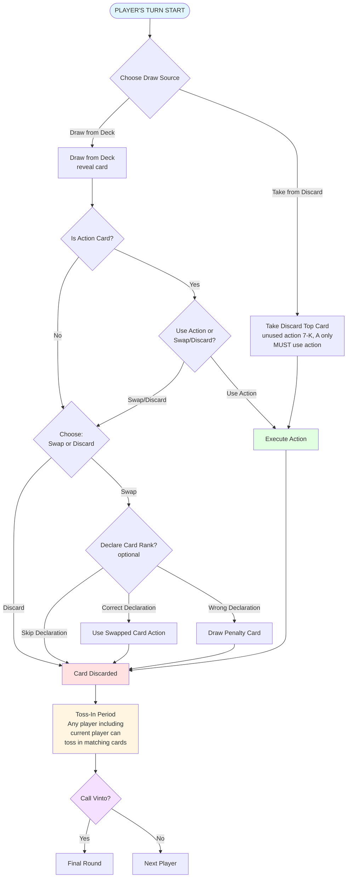

# Vinto — Official Rules (Markdown Extraction)

## Objective
Players aim to minimize the total value of their hand.
The game is played over multiple rounds.
The winner is the player with the **highest game points** at the end of the session.

---

## Game Turn Flow

### Key Decision Points:
1. **Draw Source**: Draw from deck (see card) OR take from discard pile
   - Discard option only available if top card is **unused action card (7-K, A)**
   - Taking from discard **requires** using the action immediately
2. **Action Cards (7-K, A)** from deck: Choose to use action immediately OR swap/discard
3. **Swap Decision**: If not using action, choose to swap into hand or discard
4. **Rank Declaration** (optional): When swapping, optionally declare the rank of swapped-out card
   - Correct → Use that card's action (if it has one)
   - Wrong → Draw penalty card
   - Skip → Card discarded with action unused (available for next player to take from discard)
5. **Toss-In**: After discard, **any player** (including the current player) may toss in matching rank cards
6. **Call Vinto**: At turn end, optionally declare Vinto to trigger final round

---

## Components
- Standard 52-card deck + 2 Jokers (total 54 cards).  
- For 4–5 players.  
- Each player is dealt **5 cards face-down**.  
- Players may peek at **any 2** of their own cards once, then keep them face-down.  
- Remaining cards form a **draw pile**.  
- Place one card face-up to form the **discard pile**.

---

## Card Values and Actions
- **2–6** → Value = rank; no action.  
- **7, 8** → Value = 7 or 8; action = peek one of your own cards.  
- **9, 10** → Value = 9 or 10; action = peek one card of another player.  
- **Jack (J)** → Value = 10; action = swap any two facedown cards from two different players.  
- **Queen (Q)** → Value = 10; action = peek any two cards from two different players, then optionally swap them.  
- **King (K)** → Value = 0; action = declare the value of any card and play its action.  
- **Ace (A)** → Value = 1; action = choose a player to draw one card from the deck face-down.  
- **Joker** → Value = −1; no action.

---

## Turn Options

### Option A — Draw from Deck
1. Active player draws top card from draw pile and **reveals it publicly**.  
2. If action card (7–K), player may:  
   - **Play Action** immediately (discard card, apply effect, end turn), OR  
   - **Swap**: place the drawn card facedown in their row, discard the swapped card face-up.  
     - After swap, player may **guess** the discarded card’s rank.  
       - If correct → immediately play that card’s action.  
       - If wrong → take one penalty card face-down from deck.

### Option B — Take from Discard
- Allowed only if the top discard is an **unused action card (7–K)**.  
- Player must play its action immediately.  
- Card **cannot** be swapped into hand.

---

## Reaction: Toss In
- After a card is placed on discard, any player may immediately toss in a card of the **same rank**.  
- Tossed-in card’s action resolves immediately.  
- If wrong rank → player takes back their card and draws **1 penalty card face-down**.

---

## Declaring Vinto (Final Round)
- At the **end of a player’s turn**, they may declare **“Vinto”**.  
- This triggers the **Final Round**:  
  - Each other player (the **Coalition**) takes exactly one more turn.  
  - During Final Round, **no one may interact** with the Vinto caller’s cards.

---

## Scoring a Round
1. All players reveal their cards.  
2. Compute totals (sum of values).  
3. Compare the Vinto caller’s total vs the **lowest Coalition total**:

- **If Vinto < Coalition lowest** → Vinto +3 points; each Coalition −1.  
- **If Coalition lowest < Vinto** → Vinto −1; each Coalition +3.  
- **If tie** → Vinto +3; Coalition 0.

---

## Game End
- Play continues for a **set time** (e.g., 30 minutes).  
- At time limit, finish the current round.  
- Rank players by cumulative score.  
- Award **game points** by rank:  
  - 1st = 5  
  - 2nd = 3  
  - 3rd = 2  
- Player with highest game points wins.

