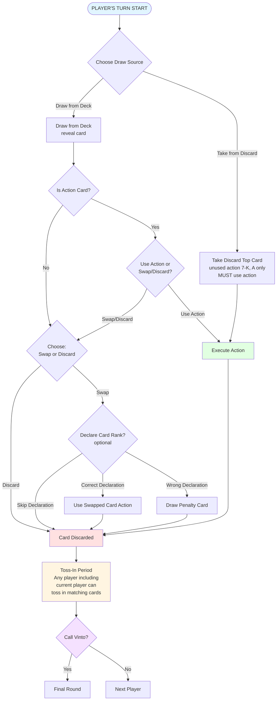

# Vinto — Official Rules (Markdown Extraction)

> Transcribed from the official composite rules PDF (*Vinto — Official Composite*, 4 pages).
> Where this file and that document disagree, the PDF wins and this file is the bug. Where the
> **engines** and the PDF disagree, see "Where the implementation differs" at the foot of this
> file — those are open decisions, because a rules change has to land in both engines and
> regenerate the parity corpus.

## Objective

Players aim to minimize the total value of their hand.
The game is played over multiple rounds.
The winner is the player with the **highest game points** at the end of the session.

---

## Game Turn Flow

```mermaid
flowchart TD
    Start([PLAYER'S TURN START]) --> DrawChoice{Choose Draw Source}

    DrawChoice -->|Draw from Deck| DrawDeck[Draw from Deck<br/>reveal card]
    DrawChoice -->|Take from Discard| TakeDiscard[Take Discard Top Card<br/>unused action 7-K, A only<br/>MUST use action]

    DrawDeck --> IsAction{Is Action Card?}

    IsAction -->|Yes| ActionChoice{Use Action or<br/>Swap/Discard?}
    IsAction -->|No| SwapOrDiscard{Choose:<br/>Swap or Discard}

    SwapOrDiscard -->|Swap| DeclareRank{Declare Card Rank?<br/>optional}
    SwapOrDiscard -->|Discard| CardDiscarded

    DeclareRank -->|Correct Declaration| UseSwappedAction[Use Swapped Card Action]
    DeclareRank -->|Wrong Declaration| Penalty[Draw Penalty Card]
    DeclareRank -->|Skip Declaration| CardDiscarded[Card Discarded<br/>action remains unused]

    UseSwappedAction --> CardDiscarded
    Penalty --> CardDiscarded

    ActionChoice -->|Use Action| ExecuteAction[Execute Action]
    ActionChoice -->|Swap/Discard| SwapOrDiscard

    TakeDiscard --> ExecuteAction

    ExecuteAction --> CardDiscarded[Card Discarded]

    CardDiscarded --> TossIn[Toss-In Period<br/>Any player including<br/>current player can<br/>toss in matching cards]

    TossIn --> CallVinto{Call Vinto?}

    CallVinto -->|Yes| FinalRound[Final Round]
    CallVinto -->|No| NextPlayer[Next Player]

    style Start fill:#e1f5ff
    style CardDiscarded fill:#ffe1e1
    style ExecuteAction fill:#e1ffe1
    style TossIn fill:#fff5e1
    style CallVinto fill:#f5e1ff
```

### Key Decision Points:

1. **Draw Source**: Draw from deck (see card) OR take from discard pile
   - Discard option only available if top card is **unused action card (7-K, A)**
   - Taking from discard **requires** using the action immediately
2. **Action Cards (7-K, A)** from deck: Choose to use action immediately OR swap/discard
3. **Swap Decision**: If not using action, choose to swap into hand or discard
4. **Rank Declaration** (optional): When swapping, optionally declare the rank of swapped-out card
   - Correct → Use that card's action (if it has one)
   - Wrong → Draw penalty card
   - Skip → Card discarded with action unused (available for next player to take from discard)
5. **Toss-In**: After discard, **any player** — including the current player — may toss in any
   number of matching cards. A wrong one costs a penalty card and bars that player for the rest
   of the round
6. **Call Vinto**: At turn end, optionally declare Vinto to trigger final round

---

## Components

- Standard 52-card deck + 2 Jokers (total 54 cards).
- For 4–5 players.
- Each player is dealt **5 cards face-down**, arranged in a row in front of them.
- Players may peek at **any 2** of their own cards once, then keep them face-down.
- Remaining cards form the face-down **draw pile**.
- The **discard pile is formed by the first card played or discarded** — the deal does not
  place one there. (An earlier version of this document said it did; the official composite
  does not, and `initializeGame` starts the pile empty.)
- The physical game also has **6 "Kind Reminder" cards** so players can look up what a rank
  does. In this app the **?** in the header is that card.

---

## Card Values and Actions

- **2–6** → Value = rank; no action.
- **7, 8** → Value = 7 or 8; action = peek one of your own cards.
- **9, 10** → Value = 9 or 10; action = peek one card of another player.
- **Jack (J)** → Value = 10; action = swap two face-down cards **belonging to two different
  players**.
- **Queen (Q)** → Value = 10; action = check two cards **belonging to two different players**,
  then swap them if you want.

> The official PDF words these as "any 2 cards on the table" and "any 2 cards", without the
> clause. **Decided: two different players**, confirmed by the product owner — a Jack that may
> swap two of your own cards is a Jack that shuffles your hand for nothing, and a Queen that
> may look at two of yours is a better 7. Both engines already enforce it.
- **King (K)** → Value = 0; action = declare the value of any card and play its action.
- **Ace (A)** → Value = 1; action = choose a player to draw one card from the deck face-down.
- **Joker** → Value = −1; no action.

---

## Turn Options

### Option A — Draw from Deck

1. Active player draws top card from draw pile and **reveals it publicly**.
2. If action card (7–K), player may:
   - **Play Action** immediately (discard card, apply effect, end turn), OR
   - **Swap**: place the drawn card facedown in their row, discard the swapped card face-up.
     - After swap, player may **guess** the discarded card’s rank.
       - If correct → immediately play that card’s action.
       - If wrong → take one penalty card face-down from deck.

### Option B — Take from Discard

- Allowed only if the top discard is an **action card (7–K) whose action has not been used**.
  Note the range: the official text says 7–K, which does not include the Ace.
- Player must play its action immediately.
- Card **cannot** be swapped into hand.

---

## Reaction: Toss In

- Immediately after a card is placed on the discard pile, **any player** who believes they hold
  the same rank may toss it in face-up on top and perform its action at once.
- **Including the player whose turn it is**, and **any number of matching cards** — the PDF
  words this as "during any other player's turn", but the decided rule is that your own turn is
  no exception and you may throw in every match you hold. Confirmed by the product owner; both
  engines already work this way.
- If wrong → they take the card back and draw **1 penalty card face-down**, **and they may not
  toss in again for the rest of the round** — including the final round after Vinto is called,
  and including other players' turns. The PDF gives only the penalty card; the bar is the
  decided rule.

> **One thing the engines get wrong here.** The bar is cleared every time the turn comes back
> round to the first seat (`advanceTurnAfterTossIn`), so it lasts one rotation rather than the
> rest of the round. Measured against the corpus: it contains exactly **one** failed toss-in,
> and **no** recorded toss-in would be refused by the longer bar — so the fix is legal for
> every recorded action, but it changes state after that one failure and so moves its hashes.

---

## Declaring Vinto (Final Round)

- At the **end of a player’s turn**, they may declare **“Vinto”**.
- This triggers the **Final Round**:
  - Each other player (the **Coalition**) takes exactly one more turn.
  - The Coalition **may work together and share information** to help one of them beat the
    Vinto player — only their single best hand is compared, so it is one team against one hand.
  - During Final Round, **no one may interact** with the Vinto caller’s cards.

---

## Scoring a Round

1. All players reveal their cards.
2. Compute totals (sum of values).
3. Compare the Vinto caller’s total vs the **lowest Coalition total**:

- **If the Vinto player wins** (their total ≤ the lowest Coalition total) → Vinto **+3**; each
  Coalition player **−1**.
- **If the Coalition wins** (lowest Coalition total < Vinto's) → Vinto **−1**; each Coalition
  player **+3**.
- **If they are level** (lowest Coalition total = Vinto's) → Vinto **+3**; each Coalition player
  **0**.

The second and third bullets settle the first: "≤" includes a tie, and a tie is the case where
the Coalition takes nothing rather than losing a point.

---

## Game End

- Play continues for a **pre-agreed time** (e.g., 30 minutes).
- When time is up, the current round is completed and players tally their cumulative scores.
- Rank players and award **game points** by rank: 1st = **5**, 2nd = **3**, 3rd = **2**.
- The player with the most **game points** wins.

> **Ambiguity in the source.** §8.2 says players are "ranked from lowest total score to
> highest", which with +3 / −1 round scoring would rank the worst player first. The engines
> rank by cumulative round points, highest first, which is the only reading consistent with
> §8.1.

---

## Where the implementation differs

Found by reading the official composite against the engines — these are shared with the
TypeScript engine, not Kotlin-only. Listed so nobody has to rediscover them, and so changing
one is a decision rather than a surprise.

| # | Official rule | What the engines do | Cost of matching |
| --- | --- | --- | --- |
| 1 | *(none — the rule itself)* | The toss-in bar is cleared once per rotation, not per round | **A bug against the decided rule.** Corpus: 1 failed toss-in, 0 actions become illegal, but hashes move after that failure |
| 2 | Option B is limited to 7–K | Any unused action card may be taken, including an Ace | Open. Tightening: **4 corpus actions** become illegal; both engines and the corpus |

**Settled, so nobody re-opens them from the PDF alone:**

- **Jack and Queen take two _different_ players.** The PDF says "any 2 cards"; the stricter rule
  is intended — a Jack that may swap two of your own cards shuffles your hand for nothing, and
  a Queen that may look at two of yours is a worse 7. Both engines already enforce it.
- **You may toss in on your own turn, and throw in every match you hold.** The PDF says "during
  any other player's turn"; the decided rule is that your own turn is no exception. Both
  engines already allow it, and 171 such actions sit in the parity corpus.
- **A wrong toss-in bars you for the rest of the round.** The PDF gives only the penalty card.
  The bar is intended, and it runs through the final round and through other players' turns —
  which is the part the engines get wrong today (row 1).
